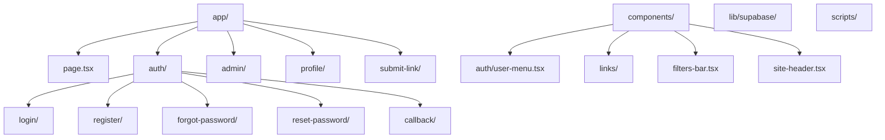

<div align="center">
  <h1> Developer Resource Hub </h1>
  <p><em>A comprehensive platform for discovering, organizing, and sharing AI tools and developer resources</em></p>
  <p>
    <a href="#features">Features</a> •
    <a href="#tech-stack">Tech Stack</a> •
    <a href="#setup-guide">Setup Guide</a> •
    <a href="#deployment">Deployment</a>
  </p>
  
  
  
  
</div>

---

## ✨ Features

### 👤 User Features

| Feature | Description |
|---------|-------------|
| **🔐 Authentication** | Secure email/password signup, login, and password reset |
| **📝 Submit Links** | Authenticated users can submit AI tools and websites |
| **🔍 Browse & Search** | View all active links with powerful full-text search |
| **🏷️ Filter by Category** | Multi-select category filtering with "match all" or "match any" modes |
| **👤 User Profile** | Manage personal profile information |
| **⚡ Real-time Updates** | See new links instantly via Supabase subscriptions |

### 🛡️ Admin Features

| Feature | Description |
|---------|-------------|
| **📊 Admin Dashboard** | View all links (active, inactive, broken) |
| **🔗 Link Management** | Change link status or delete unworking tools |
| **👥 User Management** | View user roles and permissions |
| **📈 Real-time Monitoring** | See all changes across the platform instantly |

---

## 🛠️ Tech Stack

| Component          | Technology                                                                                                                                                                                                                                                   |
| ------------------ | ------------------------------------------------------------------------------------------------------------------------------------------------------------------------------------------------------------------------------------------------------------ |
| **Frontend**       |    |
| **Styling**        |                                                                   |
| **Authentication** |                                                                                                                                                                    |
| **Database**       |  with Row-Level Security                                                                                                                                          |
| **Real-time**      |                                                                                                                                                     |
| **Deployment**     |                                                                                                                                                                               |

---

## 🚀 Setup Guide

### Prerequisites

<div align="center">
  
  
  
</div>

### Step 1: Clone and Install Dependencies

<div align="center">

```bash
# Clone the repository
git clone https://github.com/yourusername/Developer_Resource_Hub.git

# Navigate into the project directory
cd Developer_Resource_Hub

# Install dependencies
npm install
```

</div>

### Step 2: Set Up Supabase

#### 2.1 Create a Supabase Account

<details>
<summary>Click to expand</summary>

1. Visit [supabase.com](https://supabase.com)
2. Click "Start your project" or "Sign Up"
3. Sign up using your GitHub account or email
4. Verify your email if required

</details>

#### 2.2 Create a New Project

<details>
<summary>Click to expand</summary>

1. After signing in, click "New Project"
2. Select your organization (or create a new one)
3. Fill in the project details:
   - **Project Name**: Developer Resource Hub (or your preferred name)
   - **Database Password**: Create a strong password and save it securely
   - **Region**: Choose the region closest to you
4. Click "Create new project"
5. Wait for the project to be set up (this may take a few minutes)

</details>

#### 2.3 Get Your Supabase Credentials

<details>
<summary>Option A — From Settings → API</summary>

1. Once your project is ready, navigate to **Settings** > **API**
2. You'll find your credentials under the "Project API keys" section:
   - **Project URL**: Something like `https://xxxxxxxxxxxxx.supabase.co`
   - **anon public**: A long JWT token starting with `eyJhbGciOiJIUzI1NiIsInR5cCI6IkpXVCJ9...`
   - **service_role**: Another JWT token (keep this secret)

</details>

<details>
<summary>Option B — From Connect → Next.js</summary>

Inside your Supabase project, at the top bar you'll see something like:
`developer_resource_hub / main / Production / Connect`

Click Connect.

Choose:
- App Frameworks → Next.js
- With App Router
- Using supabase-js

Supabase will show you a block like:
`NEXT_PUBLIC_SUPABASE_URL=https://your-project-id.supabase.co NEXT_PUBLIC_SUPABASE_ANON_KEY=your-anon-key`

These are the exact two values you need for this project.

✅ You do not need to copy any other connection strings for this app to work locally.

</details>

### Step 3: Configure Environment Variables

1. In the root directory of your project, create a new file named `.env.local`
2. Add the following environment variables to your `.env.local` file:

```env
# Supabase Configuration
NEXT_PUBLIC_SUPABASE_URL=https://your-project-id.supabase.co
NEXT_PUBLIC_SUPABASE_ANON_KEY=your-anon-key-here
NEXT_PUBLIC_DEV_SUPABASE_REDIRECT_URL=http://localhost:3000
```

> **Note**: Replace the placeholder values with your actual Supabase credentials. The database connection strings are optional for most use cases but included for completeness.

### Step 4: Set Up Database Tables

#### 4.1 Access the SQL Editor

1. In your Supabase dashboard, navigate to **SQL Editor** in the left sidebar
2. Click on "New query" to open a new SQL editor window

#### 4.2 Create Database Tables

1. Open the `scripts/001_create_tables.sql` file in your local project
2. Copy the entire content of the file
3. Paste it into the Supabase SQL Editor
4. Click "Run" to execute the SQL script
5. Wait for the script to complete (you should see a success message)

This script will create:

- A `profiles` table that extends the `auth.users` table
- A `links` table for storing resource links
- Row Level Security (RLS) policies for both tables
- Triggers to automatically create a profile when a new user signs up

### Step 5: Create an Admin User

#### 5.1 Sign Up a New User

1. Start your development server (if not already running):
   ```bash
   npm run dev
   ```
2. Open [http://localhost:3000](http://localhost:3000) in your browser
3. Navigate to the registration page or use `/auth/register`
4. Create a new account with your email and a secure password
5. Check your email for a verification link and click it to verify your account

#### 5.2 Grant Admin Privileges

1. Go back to the Supabase dashboard
2. Navigate to **SQL Editor** and open a new query
3. Run the following SQL to grant admin privileges to your user:

```sql
UPDATE public.profiles
SET role = 'admin'
WHERE email = 'your-email@example.com';
```

Replace `your-email@example.com` with the email you used to register.

4. Verify the admin role was assigned:

```sql
SELECT id, email, role FROM public.profiles WHERE email = 'your-email@example.com';
```

You should see your email with the role set to `admin`.

### Step 6: Run the Application

Now you're ready to run the application:

```bash
npm run dev
```

Open [http://localhost:3000](http://localhost:3000) in your browser to see the application running.

- You can sign in with your admin account
- Access the admin dashboard at `/admin`
- Start adding and managing resources

---

## 📁 Project Structure



---

## 🔒 Security

| Security Feature | Description |
|------------------|-------------|
| **🛡️ Row-Level Security (RLS)** | All tables protected with RLS policies |
| **👤 User Isolation** | Users can only view/edit their own data |
| **👑 Admin Access** | Admins can manage all links |
| **✉️ Email Verification** | Required for account activation |
| **🔐 Password Reset** | Secure email-based password recovery |

---

## 🌐 Deployment

### Deploy to Vercel

<div align="center">

```bash
# 1. Push your code to GitHub
git add .
git commit -m "Ready for deployment"
git push origin main

# 2. Import repository on https://vercel.com
# 3. Add environment variables:
#    - NEXT_PUBLIC_SUPABASE_URL
#    - NEXT_PUBLIC_SUPABASE_ANON_KEY
# 4. Deploy
```

</div>

---

## 🧩 Troubleshooting

<details>
<summary>"User not authenticated"</summary>

- Verify email is confirmed
- Check Supabase session is valid
- Try logging out and back in

</details>

<details>
<summary>Links not appearing</summary>

- Ensure link status is 'active'
- Check RLS policies in Supabase
- Check browser console for errors

</details>

<details>
<summary>Admin dashboard not accessible</summary>

- Verify user role is 'admin' in profiles table
- Log out and back in

</details>

<details>
<summary>Database Connection Issues</summary>

- Verify your Supabase credentials in `.env.local`
- Check if your database is paused in Supabase dashboard
- Ensure your SQL scripts ran successfully

</details>

---

## 📚 Resources & Support

<div align="center">

<a href="https://supabase.com/docs">
  
</a>
<a href="https://nextjs.org/docs">
  
</a>
<a href="https://ui.shadcn.com">
  
</a>

</div>

---

## 📄 License

<div align="center">

 MIT

</div>

---

<div align="center">
  <p>Made with ❤️ by the Developer Resource Hub Team</p>
  <p>⭐ Star this repo if it helped you!</p>
</div>
